# [HIGHER WINS](https://efthymiakakoulidou.github.io/higher-wins)

Higher Wins is a card game where the player plays against the computer. The target audience can be children but is also fun to play for everyone!
It begins giving the instructions to the player and introducing the deck.

The deck has 24 cards from 1 to 12, two of each numder.
The higher card is the one with the number 12 and the lower one is the one with the number 1.
Both players get 8 cards. 
You have the right to replace your lowest card with one of the remaining cards at a risk that it might be a lower one (unless of course if you have a card with number '1' on it so there is no risk, you have nothing to lose as there is not a lower card).
Both players draw a card simultaneously.
The one that has the higher card wins!

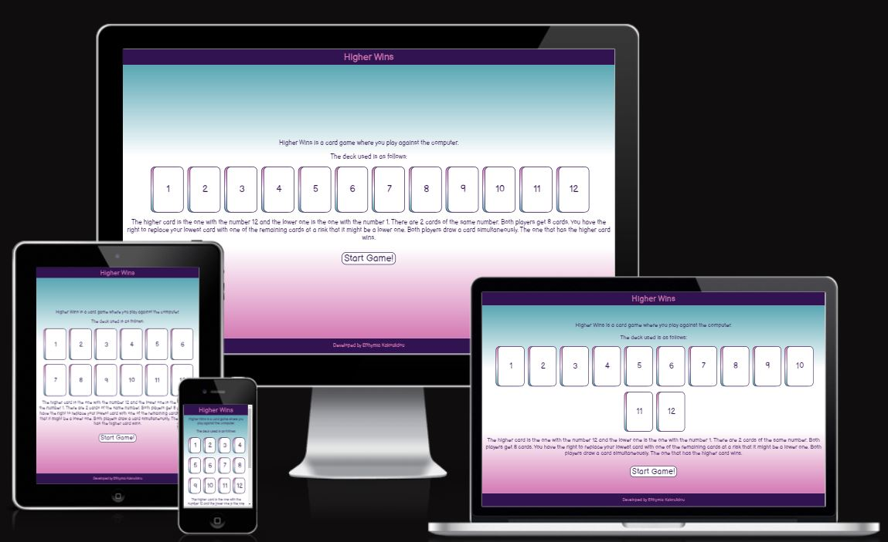

## UX

As the game is aiming a younger audience also, it was very important to have a clear structure and navigation, and fun colours.

### Colour Scheme

Fun bright colours where chosen and I did not want any association with gambling card-games so I avoided green, red, and black as well as suits. With this choice of colours I achieved sufficient contrasts for accessibility.

- rgb(50, 19, 81) used for primary text.
- rgb(212, 121, 180) and rgb(88, 166, 179) used for secondary text and to indicate the places on the screen where the computer or the player play.

I used [coolors.co](https://coolors.co/e84610-009fe3-4a4a4f-445261-d63649-e6ecf0-000000) to generate my colour palette.

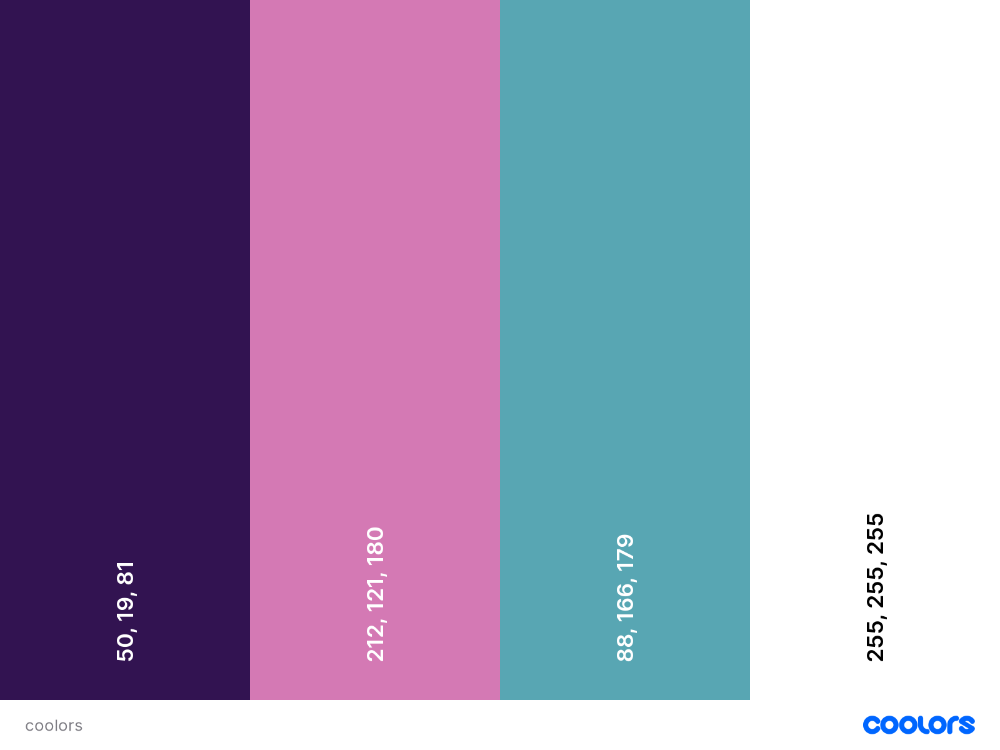

### Typography

I used Google Fonts and/or Font Awesome for my text and icons as well as https://icons8.com/icons/set/cards for my favicon.
I used one font throughout the project for consistency. I chose a font which reminded me of comics again to make it playful and to be liked by children.

- [Balsamiq](https://fonts.googleapis.com/css2?family=Balsamiq+Sans&display=swap) was used for the primary headers and titles.

- [Font Awesome](https://fontawesome.com) icons were used for the navigation and to refresh the page.

To follow best practice, wireframes were developed for mobile, tablet, and desktop sizes.
I've used [Balsamiq](https://balsamiq.com/wireframes) to design my site wireframes.

### Mobile Wireframes

 Click here to see the Mobile Wireframes 

Home
  - 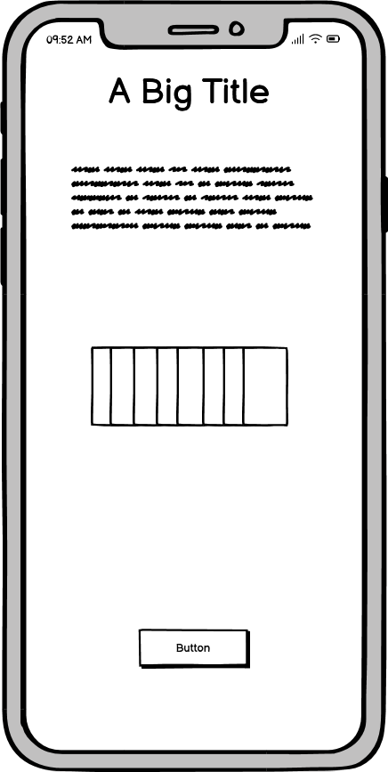

Game Page
  - 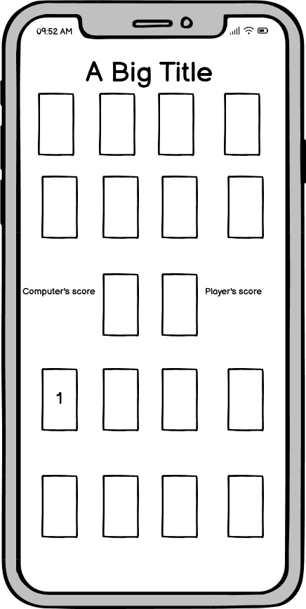

### Desktop Wireframes

 Click here to see the Desktop Wireframes 

Home
  - 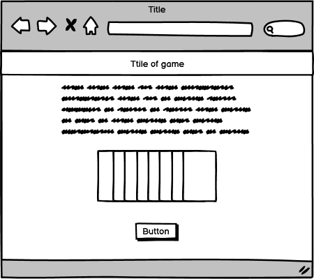

Game Page
  - 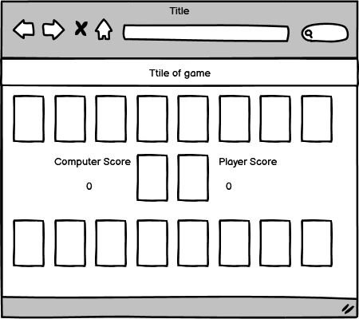

## Features

The game consists of a start page where the instructions are given, the deck is introduced and a button whith which the player can start the game and a game page. After the start-button is pushed the player gets a window with the question if he/she wants to replace his/hers lowest card with the first one of the pile of the remaining cards. After the player makes the choice he/she proceeds to play. 
The player can choose a card from his/hers hand which then is placed in the middle of the screen at the place where the player's cards go. The computer does the same thing. The computer chooses randomly one card of its hand. 
The two cards stand next to each other and the comparison is made. This updates the score. The one with the higher card gets one point. In the case that the cards chosen have the same value no one gets a point.

### Existing Features

- **Instructions**

    - The instructions are essential to play the game. One has to read them to understand what to do.

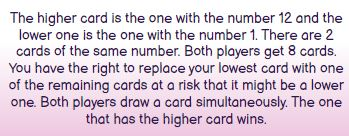

- **Deck**

    - The deck is presented both visually and in text. 
    Here the player gets a first glimpse of what the cards look like on both sides. This is important because the player's hand is open but the computer's cards are closed. 

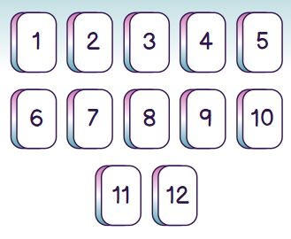

- **Start button**

    - After going through all the information the player can push the 'Start Game!' to start playing.

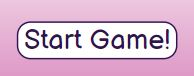

- **Navigation and refresh options**

    - We are now in the game page. In the header beside the title of the game there are the navigation link which leads to the start page and the restart button which refreshes the page. In this way the player has the opportunity to interrupt the game at any point and read the instructions again or start over.

- **The window where the player can make the choice of replacing the lowest card**

    - Before entering the actual game and start playing the player has the choice of replacing his/hers lowest card. 
    The window giving this option is placed in such a way that the user knows that it is something working independently and if you click on it, it will disappear. It is placed also above the player's hand so that it is fully shown and the player knows that it is one of these cards that is going to be changed. It partially hides the computer's hand so that the player knows that you cannot affect those cards.
    At the same time the card with lowest value blinks so that player knows that this card is going to be replaced. 

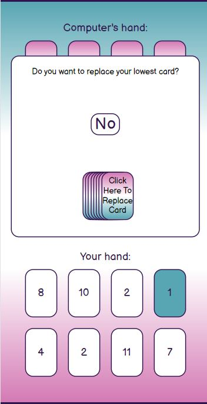

- **Clicking the 'No' button**

    - If the player choses not to replace the lowest card the game starts, the lowest card's colour disappears and it becomes like the rest of the cards.

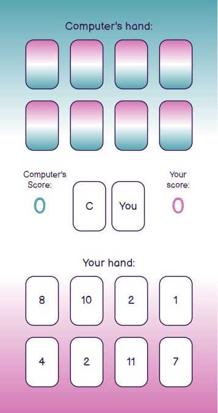

- **Clicking the remaining cards' pile**

    - If the player choses to replace the lowest card then it is replaced by a new card from the pile of the remaining cards, and the game starts.

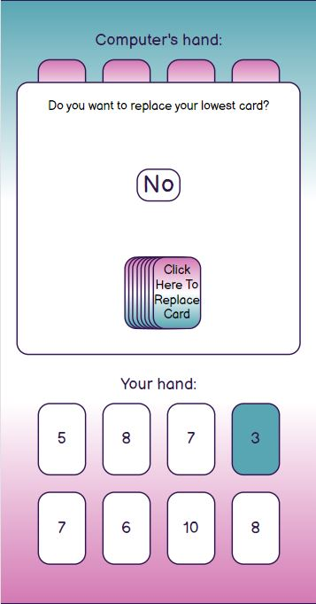 
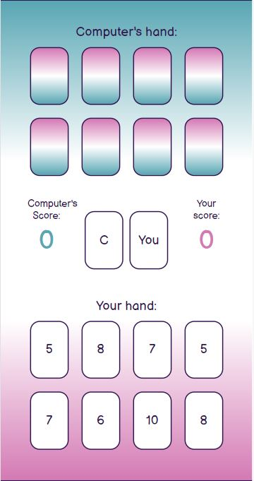 

- **Game layout**

    - The game starts. On the top of the screen there are the computer's closed cards with a title for making it even more clear.
    In the middle there is the game area. There are two spots in the middle where the player and the computer place their cards using also text to clarify it. Next to each spot there is the score area. The score for the player is next to player's played card and the score of the computer is next to computer's played card. This is also indicated with colours. The plaeyr's score has the colour of the background of the player's hand and the colour of the computer's score has the colour of the background of computer's hand.
    At the bottom of the page there are the player's open cards.

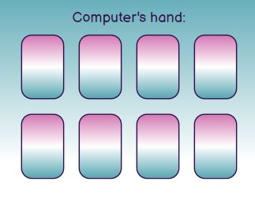 
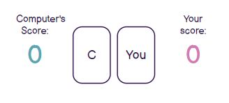 
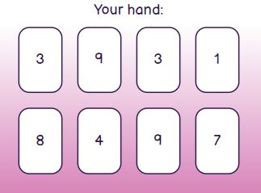 

- **Game begins**

    - When the player chooses a card the card disappears from his/hers hand and is placed in the game area. The same with the computer's randomly chosen card. The score is being updated and the first round is over. This continues until the players run out of cards.

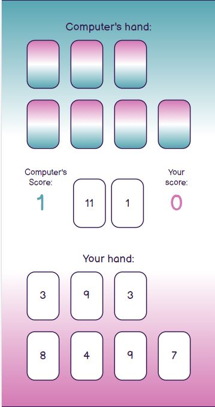 

- **Game ends**

    - The game ends when there are no cards left and the message if you win or lose appears on the screen along with a button to start over. Also here the colour of the message corresponds to the player's colour and the computer's colour respectively.The message appears with a small delay so that you have the time to see the final score.

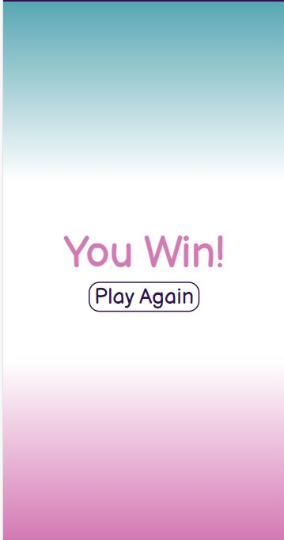 

### Future Features

In the future the game coud be more complex. It could have more cards in the initial deck and the player could replace more of his/hers cards. Adding complexity could make it more interesting and target an older audience. Being able to replace more cards could increase the excitement as you are called to take a risk there.
Also it could keep track of the wins or loses to have an overall idea of how it is going for you. 

## Tools & Technologies Used

- [HTML](https://en.wikipedia.org/wiki/HTML) used for the main site content.
- [CSS](https://en.wikipedia.org/wiki/CSS) used for the main site design and layout.
- [CSS Flexbox](https://www.w3schools.com/css/css3_flexbox.asp) used for an enhanced responsive layout.
- [JavaScript](https://www.javascript.com) used for user interaction on the site.
- [Git](https://git-scm.com) used for version control. (`git add`, `git commit`, `git push`)
- [GitHub](https://github.com) used for secure online code storage.
- [GitHub Pages](https://pages.github.com) used for hosting the deployed front-end site.
- [Gitpod](https://gitpod.io) used as a cloud-based IDE for development.

## Testing

For all testing, please refer to the [TESTING.md](TESTING.md) file.

## Deployment

The site was deployed to GitHub Pages. The steps to deploy are as follows:

- In the [GitHub repository](https://github.com/EfthymiaKakoulidou/higher-wins), navigate to the Settings tab 
- From the source section drop-down menu, select the **Main** Branch, then click "Save".
- The page will be automatically refreshed with a detailed ribbon display to indicate the successful deployment.

The live link can be found [here](https://efthymiakakoulidou.github.io/higher-wins)

### Local Deployment

This project can be cloned or forked in order to make a local copy on your own system.

#### Cloning

You can clone the repository by following these steps:

1. Go to the [GitHub repository](https://github.com/EfthymiaKakoulidou/higher-wins) 
2. Locate the Code button above the list of files and click it 
3. Select if you prefer to clone using HTTPS, SSH, or GitHub CLI and click the copy button to copy the URL to your clipboard
4. Open Git Bash or Terminal
5. Change the current working directory to the one where you want the cloned directory
6. In your IDE Terminal, type the following command to clone my repository:
	- `git clone https://github.com/EfthymiaKakoulidou/higher-wins.git`
7. Press Enter to create your local clone.

Alternatively, if using Gitpod, you can click below to create your own workspace using this repository.

Please note that in order to directly open the project in Gitpod, you need to have the browser extension installed.
A tutorial on how to do that can be found [here](https://www.gitpod.io/docs/configure/user-settings/browser-extension).

#### Forking

By forking the GitHub Repository, we make a copy of the original repository on our GitHub account to view and/or make changes without affecting the original owner's repository.
You can fork this repository by using the following steps:

1. Log in to GitHub and locate the [GitHub Repository](https://github.com/EfthymiaKakoulidou/higher-wins)
2. At the top of the Repository (not top of page) just above the "Settings" Button on the menu, locate the "Fork" Button.
3. Once clicked, you should now have a copy of the original repository in your own GitHub account!

### Local VS Deployment

There are no differences on the local and live version.

## Credits

### Content

| Source | Location | Notes |
| --- | --- | --- |
| [Markdown Builder](https://tim.2bn.dev/markdown-builder) | README and TESTING | tool to help generate the Markdown files |
| [W3Schools](https://www.w3schools.com/howto/howto_js_topnav_responsive.asp) | entire site | html, css and js |
| [W3Schools](https://www.w3schools.com/css/css3_variables.asp) | entire site | how to use CSS :root variables |
| [Flexbox ](https://css-tricks.com/snippets/css/a-guide-to-flexbox/) | entire site | responsive layouts |
| [StackOverflow](https://stackoverflow.com/a/2450976) | entire site | Fisher-Yates/Knuth shuffle in JS and everything that I had trouble with. |
| [Youtube](https://www.youtube.com/watch?v=NxRwIZWjLtE&t=876s) | entire site | Structure the game |
| [Youtube](https://www.youtube.com/watch?v=PkZNo7MFNFg&t=5493s) | entire site | Understand the essentials of js |

### Acknowledgements

- I would like to thank my Code Institute mentor, [Tim Nelson](https://github.com/TravelTimN) for their support throughout the development of this project.
- I would like to thank the [Code Institute Slack community](https://code-institute-room.slack.com) for the moral support; it kept me going.
- I would like to thank my daughter, who helped me pick the game I was going to do. It is a game that we play together with real cards.
